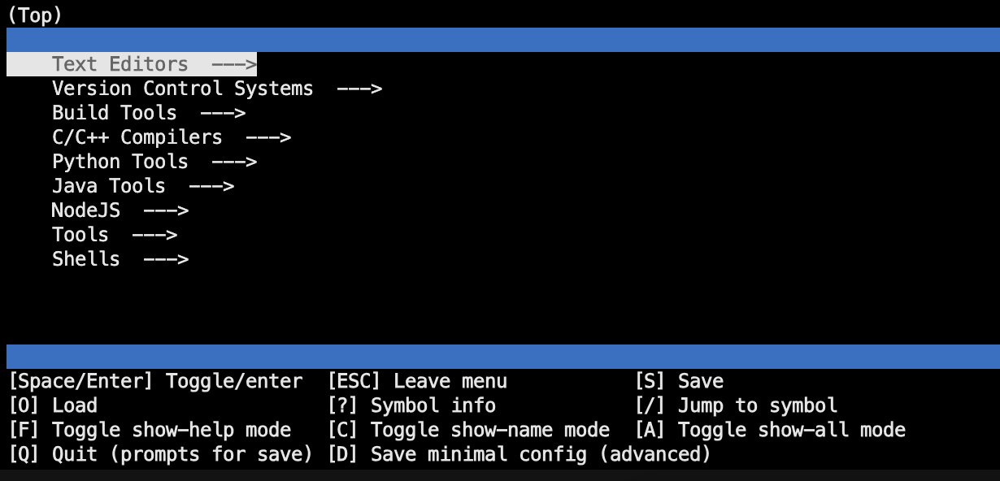

# Devtools installer

A simple program to select and install packages with a terminal menu interface.

## Usage

1. Git clone the repository
2. Run `bash run.sh` in the terminal. This will install the necessary dependencies and run the program.
3. Select the packages you want to install from the menu.
4. The program will install the selected packages and then return you to the terminal.

## Licence

This project is licensed under the GNU General Public License v3.0 - see the [LICENCE](LICENCE) file for details.